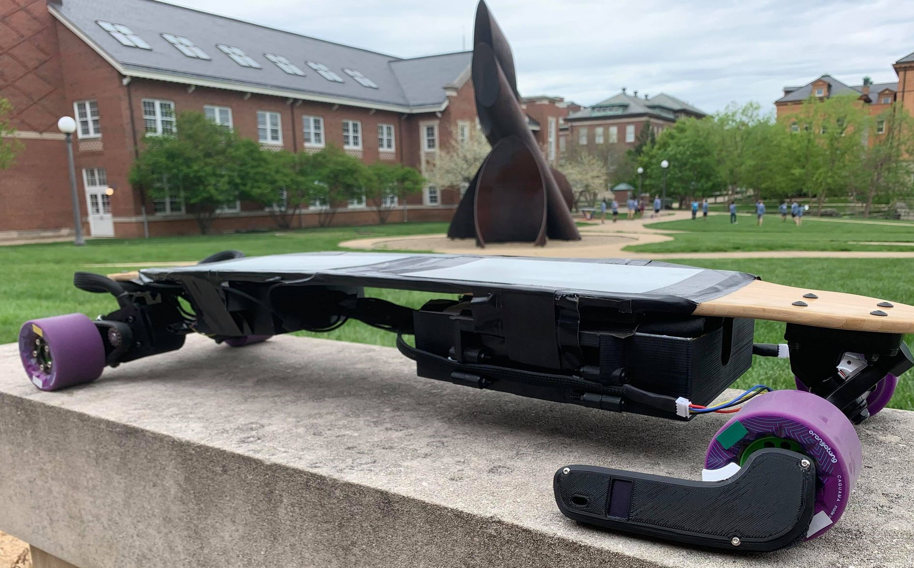
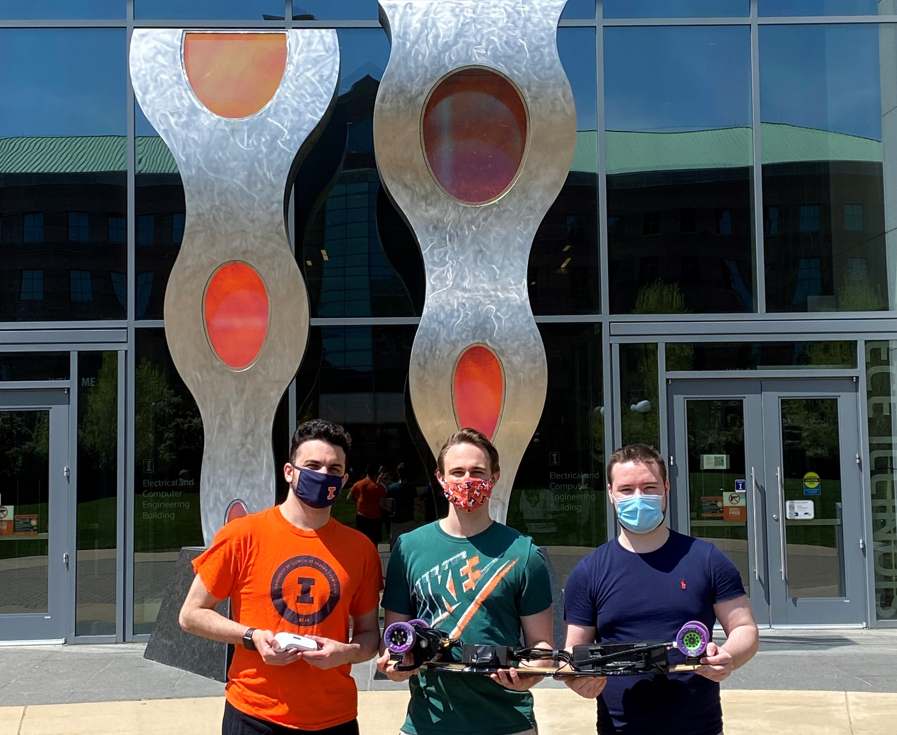

# Safety Suite For Electric Longboard

The goal of the project is to increase safety for electric longboard users by electronically preventing wheel slippage and automatically stopping the board if the user is ejected.

Team members:

- [Pouya Akbarzadeh](https://github.com/OfficialPouya)
- [Alexander Krysl](https://github.com/axkrysl47)
- [Patrick Stach](https://github.com/pat-stach)

## Results

[Demo](https://www.youtube.com/playlist?list=PLA1k06jt2lX-8_wawuwcJB9zIEW_f2nJa)

[Presentation](https://www.youtube.com/watch?v=MWs525hmZTg)

Original project repo located [here](https://github.com/OfficialPouya/Safety_Suite_For_Electric_Longboard).
