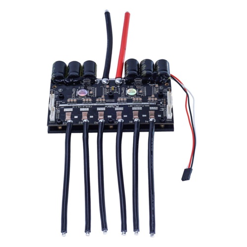

# 2021-02-05 - Discussion with Professor Schuh

Professor Schuh gave us the idea to use piezo resistors or Velostat to perform the weight/pressure sensing that we need. Additionally, the tilt sensing probably won’t be necessary - we can correspond the rear left wheel with the front left wheel and rear right wheel with the front right wheel, as those pairs of wheels should be spinning at roughly the same velocity during turning. This simplifies our design.

# 2021-02-10 - Parts Updates

Currently, I am looking at Dual VESC options that can simplify our design, minimize space.
Here are some examples:

[link](https://flipsky.net/collections/electronic-products/products/dual-fsesc6-6-based-upon-vesc6-with-
aluminum-heatsink)

This one has dual MCUs, with a physical switch to include or disclude the CAN connection
between both of the VESCs.

[link](https://massivestator.com/products/focbox-unity-dual-motor-controller)

This one has a single MCU that acts for both motors.

I am currently speaking with Loaded Boards, a longboard deck and skateboard wheel company that Boosted had a business relationship with. They are willing to send a B-grade deck and wheels at a lower price. Wheel durometer options are 77a, 80a, 83a. The lower the durometer number, the softer the
wheel urethane.

After discussions with the team, we decided on the hardest wheel option, 83a, as it would slip easier than the softer wheels. We want to make sure we can demonstrate traction control in our project.

For weight sensing, I also came across a flexiforce sensor that we may consider using. The board will weigh about 20 pounds, we ideally would like a range of double that. This flexiforce sensor is high on my list.

[link](https://www.tekscan.com/products-solutions/force-sensors/a401?tab=specifications-performance)

# 2021-02-12 - Acquiring a Battery

I have contacted several custom battery builders in the esk8 (custom electric longboard builders) forum, located [here](https://forum.esk8.news/).  Builder Zach Tetra from [Black Fox Builds](https://forum.esk8.news/t/black-fox-boards-east-coast-battery-building-services/37402) has the following pair of 6s4p batteries that he can send immediately:

For our project, I would prefer a 12s battery for adequate performance. The pack above is made up of Samsung 30Q cells, I found more info [here](https://lygte-info.dk/review/batteries2012/Samsung%20INR18650-30Q%203000mAh%20(Pink)%20UK.html). We can convert the 6s4p pack into a 12s2p pack, which will be nearly 200Whr.
This will be plenty, for up to 10 miles of range. I have never worked on batteries before. When researching how to do so, I found this over-an-hour-long video [here]( https://www.youtube.com/watch?v=7QjO90LG67g), that clearly depicts and describes everything required to safely build a reliable battery pack.

I will need access to a spot welder to complete this - we’ve reached out to Illini Solar Car, as they have claimed the spot welder on campus.
